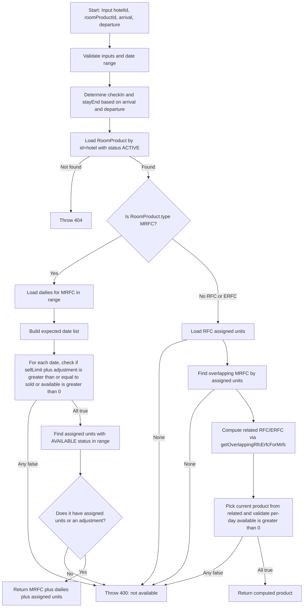

## roomProductCheckAvailability



---

## processRoomUnitAvailabilityUpdate

```mermaid
flowchart TD
  A[Start: hotelId, roomProductId, arrival, departure, roomUnitIds[]] --> B[Validate inputs and date range]
  B --> C[Make date list for stay]
  C --> D[Begin Transaction]
  D --> E{roomUnitIds length > 0?}
  E -->|Yes| F[Upsert RoomUnitAvailability to ASSIGNED for each unit/date]
  E -->|No (oversell)| G[Skip unit status change]
  F --> H
  G --> H
  H --> I[Load RoomProduct (type, rfcAllocationSetting)]
  I -->|Not found| Z1[Rollback + Throw 404]
  I --> J{type == MRFC?}
  J -->|Yes| K[updateMrfcAvailability\n(available -= n, sold += n)]
  J -->|No| L[updateRelatedMrfcsForRfcErfc]
  L --> M{rfcAllocationSetting == ALL?}
  M -->|Yes| N[Load ALL assigned units for product\nMerge into target units]
  M -->|No| O[Use provided units]
  N --> P
  O --> P
  P --> Q[Find related MRFCs via overlap room units]
  Q -->|None| Z2[Rollback + Throw 400]
  Q --> R[For each MRFC\ncount overlapping units\nupdateMrfcAvailability by that count]
  R --> S[Commit]
  S --> T[Return {success, datesUpdated}]
```

---

## roomProductReleaseAvailability

```mermaid
flowchart TD
  A[Start: hotelId, roomProductId, arrival, departure, roomUnitIds[]] --> B[Validate inputs/date]
  B --> C[Build date list]
  C --> D[Find RoomUnitAvailability rows in range]
  D -->|None| E[Throw 404]
  D --> F[Begin Transaction]
  F --> G[Set those RoomUnitAvailability rows to AVAILABLE\n(only if previously ASSIGNED)]
  G --> H[Load RoomProduct (type)]
  H -->|Not found| Z1[Commit + Warn + Return]
  H --> I{type == MRFC?}
  I -->|Yes| J[revertMrfcAvailability\n(sellLimit = min(sellLimit+cnt, available), sold -= cnt)]
  I -->|No| K[revertRelatedMrfcsForRfcErfc]
  K --> L{rfcAllocationSetting == ALL?}
  L -->|Yes| M[Load ALL assigned units for product\nMerge into target]
  L -->|No| N[Use provided units]
  M --> O
  N --> O
  O --> P[Find related MRFCs via overlap]
  P -->|None| Q[Commit + Warn + Return]
  P --> R[For each MRFC\ncount overlapping units\nrevertMrfcAvailability by that count]
  R --> S[Commit]
  S --> T[Return released units]
```

---

## getOverlappingRfcErfcForMrfc

```mermaid
flowchart TD
  A[Start: hotelId, MRFC roomProductId, arrival, departure] --> B[Validate inputs/date]
  B --> C[Load MRFC with dailies + assigned units]
  C -->|Not found| D[Throw 404]
  C --> E[Collect MRFC roomUnitIds]
  E --> F[Load RFC/ERFC products overlapping those units]
  F --> G[For each RFC/ERFC:
    - filter assigned units to overlapping set
    - compute per-day available from unit availability
    - cap by MRFC remaining (available+adjustment - sold)
    - attach all assigned units (for response)
  ]
  G --> H[Sort by room number and return]
```

---

## updateRoomUnitAvailabilityStatus

```mermaid
flowchart TD
  A[Start: hotelId, roomProductId, startDate, endDate, status] --> B[Validate inputs/date]
  B --> C[Fetch assigned roomUnitIds for product]
  C -->|None| D[Throw 404]
  C --> E[Build date list]
  E --> F[Upsert RoomUnitAvailability rows to given status for each unit/date]
  F --> G[Return {updated, unitCount, dates}]
```

---

## manualUpsertDailyAvailability

```mermaid
flowchart TD
  A[Start: hotelId, roomProductId, startDate, endDate, available?, adjustment?] --> B[Validate inputs/date]
  B --> C[Build date list]
  C --> D[Load existing rows in range]
  D --> E[For each date: ensure proposed (available + adjustment) >= sold]
  E -->|Violation| F[Throw 400]
  E --> G[Insert missing rows (ignore conflicts)]
  G --> H[Update provided fields for rows in range]
  H --> I[Return {updated, dates}]
```

---

## updateMrfcAvailability (helper)

```mermaid
flowchart TD
  A[Input: trx, hotelId, mrfcId, dates[], roomUnitIds[]] --> B[inc = roomUnitIds.length || 1]
  B --> C[UPDATE room_product_daily_availability\nSET available = GREATEST(available - inc, 0),\n    sold = sold + inc\nWHERE hotel_id = hotelId AND room_product_id = mrfcId\nAND date IN (dates)]
  C --> D[Done]
```

---

## revertMrfcAvailability (helper)

```mermaid
flowchart TD
  A[Input: trx, hotelId, mrfcId, dates[], roomUnitIds[]] --> B[dec = roomUnitIds.length || 1]
  B --> C[UPDATE room_product_daily_availability\nSET sell_limit = LEAST(available + dec, sell_limit),\n    sold = GREATEST(sold - dec, 0)\nWHERE hotel_id = hotelId AND room_product_id = mrfcId\nAND date IN (dates)]
  C --> D[Done]
```

---

## updateRelatedMrfcsForRfcErfc (helper)

```mermaid
flowchart TD
  A[Input: trx, hotelId, roomProductId, roomProduct, dates[], roomUnitIds[]] --> B{rfcAllocationSetting == ALL?}
  B -->|Yes| C[Load ALL assigned unitIds and merge]
  B -->|No| D[Use provided unitIds]
  C --> E
  D --> E
  E --> F[Find related MRFCs via overlapping units]
  F -->|None| G[Throw 400]
  F --> H[Build map MRFC -> overlapping unitIds]
  H --> I[For each MRFC: call updateMrfcAvailability with its overlap count]
  I --> J[Done]
```

---

## revertRelatedMrfcsForRfcErfc (helper)

```mermaid
flowchart TD
  A[Input: trx, hotelId, roomProductId, roomProduct, dates[], roomUnitIds[]] --> B{rfcAllocationSetting == ALL?}
  B -->|Yes| C[Load ALL assigned unitIds and merge]
  B -->|No| D[Use provided unitIds]
  C --> E
  D --> E
  E --> F[Find related MRFCs via overlapping units]
  F -->|None| G[Warn and exit]
  F --> H[Build map MRFC -> overlapping unitIds]
  H --> I[For each MRFC: call revertMrfcAvailability with its overlap count]
  I --> J[Done]
```


